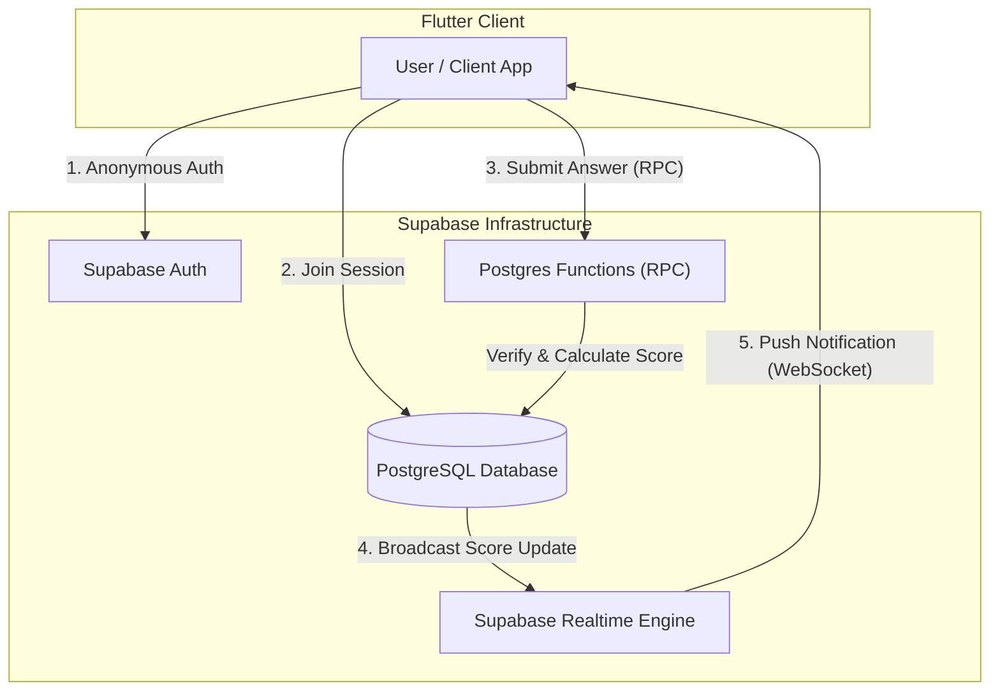
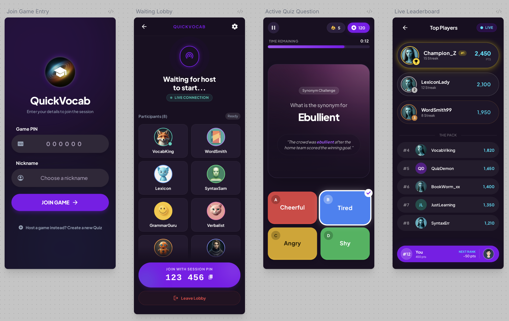
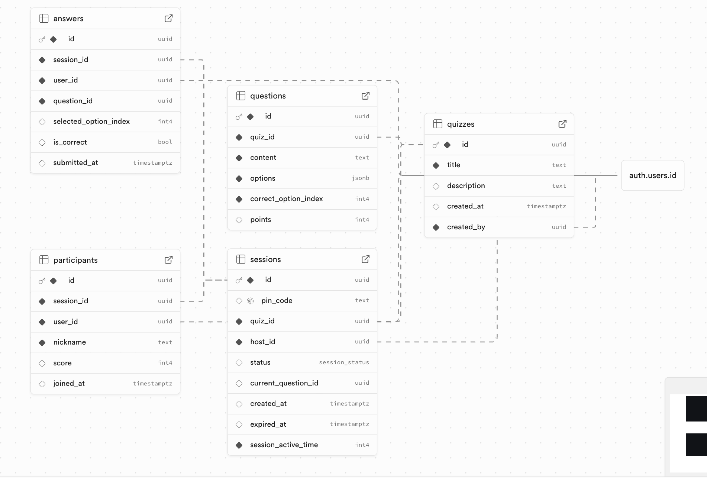
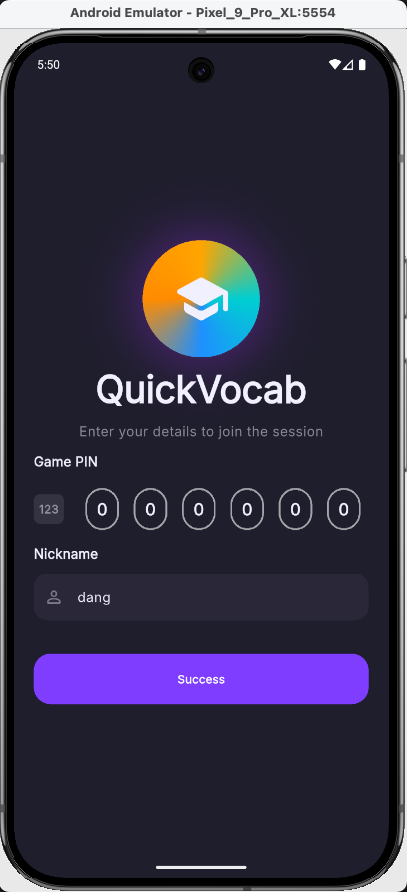
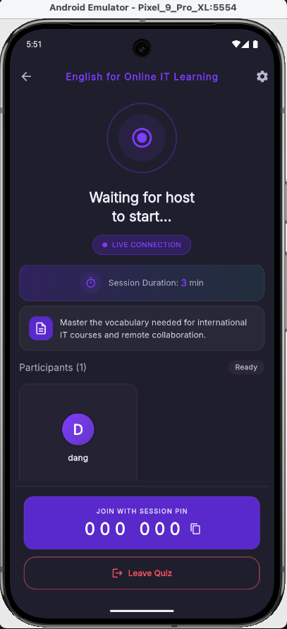
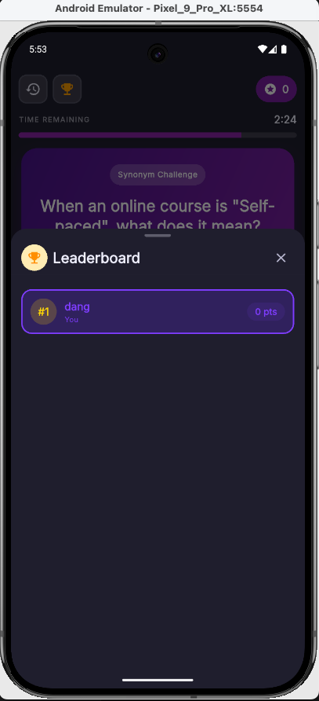

# Real-Time Vocabulary Quiz - System Design Document

## 1. Overview

This document outlines the technical architecture for the Real-Time Vocabulary Quiz application. The solution leverages a **Serverless Architecture** using **Supabase** as the Backend-as-a-Service (BaaS) to ensure rapid development, high scalability, and seamless real-time capabilities. The client application is built with **Flutter** for a high-performance, cross-platform user experience.

---

## 2. Architecture Diagram

The system follows a reactive client-server model where the client subscribes to database changes for real-time updates.



## 3. Component Description

### A. Client Side (Flutter Application)

* **Design Pattern:** **Clean Architecture** with **MVVM** (via BLoC) to ensure separation of concerns and testability.
* **Tech Stack:**
  * **State Management:** `flutter_bloc` for business logic and state control.
  * **Code Generation:** `freezed` & `json_serializable` for immutable entities and robust networking.
  * **Routing:** `go_router` for deep linking and declarative navigation.
  * **DI:** `get_it` for dependency injection.
* **Module Breakdown (`lib/`):**
  * **Domain Layer (`domain/`):** The core business logic, independent of UI or external frameworks.
    * **Entities:** Immutable core models including `AuthUser`, `Session`, `Question`, `Participant`, and `Answer`.
    * **Repositories:** Abstract interfaces contract (e.g., `IAuthRepository`, `ISessionRepository`) defining data operations.
    * **UseCases:** Encapsulates specific application actions (14+ use cases implemented).
  * **Infrastructure Layer (`infrastructure/`):**
    * **Implementation:** Concrete repository implementations using **Supabase SDK**.
    * **Realtime:** Manages WebSocket subscriptions to tables like `quiz_sessions` and `participants`.
  * **Presentation Layer (`presentation/`):** Organized by feature.
    * **entries:** Handles app initialization and join flow (PIN entry).
    * **lobby:** Waiting screen for participants, listening for "START" signal from `Session`.
    * **arena:** proper game loop interface, displaying real-time `Question` updates.
    * **leaderboard:** Live ranking display consuming stream updates from `Participant` table.
    * **session:** Manages global session state.

### B. Backend Side (Supabase BaaS)

* **Database (PostgreSQL):** The source of truth for all data (Users, Quizzes, Sessions, Answers).
* **Auth Service:** Manages user identity (Anonymous Users).
* **Realtime Engine:** Uses PostgreSQL's Replication Log (WAL) to broadcast database changes to connected clients via WebSockets.
* **Edge Logic (PostgreSQL Functions):**
  * **Function `submit_answer`:** Acts as a secure API endpoint. It accepts user input, fetches the correct answer from the server (preventing cheating), calculates points, logs the answer, and updates the score transactionally.

## 4. Data Flow

### Scenario: Real-time Scoring & Leaderboard Update

1. **Submission:** User taps an answer. The Flutter app calls the `submit_answer` RPC function with `session_id`, `question_id`, and `selected_option`.
2. **Processing (Server-side):**
    * The Database Function verifies the answer against the `questions` table.
    * If correct, it calculates points.
    * It inserts a record into `answers` (audit log).
    * It performs an atomic `UPDATE` on the `participants` table to increment the score.
3. **Broadcasting:**
    * The `UPDATE` operation triggers Supabase Realtime.
    * Supabase broadcasts a payload `{ new: { user_id: "...", score: 150, ... } }` to all clients subscribed to the session channel.
4. **UI Update:**
    * All connected devices receive the payload.
    * The Flutter app automatically re-orders the list based on the new scores and updates the Leaderboard UI.
    * **Latency:** Estimated < 100ms.

## 5. Technology Stack & Justification

### A. Core Technology Stack

| Component | Technology | Justification |
| :--- | :--- | :--- |
| **Frontend** | Flutter | Cross-platform (iOS/Android/Web) with stable 60fps performance. Excellent Stream support fits perfectly with Realtime updates. |
| **Backend** | Supabase | **BaaS (Backend-as-a-Service)**. Provides Database, Auth, and Realtime Engine out-of-the-box, saving ~70% of backend development time compared to a custom Go/Node.js server. |
| **Database** | PostgreSQL | The world's most advanced open-source relational database. Supports **JSONB** for flexible data and **RPCS** for server-side logic. |
| **Realtime** | Supabase Realtime | Utilizes PostgreSQL's **WAL (Write Ahead Log)** to broadcast database changes to clients via WebSockets instantly. |

### B. AI & Development Tools

| Tool | Category | Role in Project |
| :--- | :--- | :--- |
| **Google Gemini** | LLM / Reasoning | Strategic partner for System Design, Schema Modeling, and Data Seeding. Used for high-level architectural decisions and reasoning. |
| **Cursor AI** | Code Editor / Copilot | The primary IDE. Used for writing boilerplate code (Bloc, Repositories), refactoring, and implementing business logic based on defined architectural standards. |
| **Design Stitch** | UI Generative AI | Generated high-fidelity mockups (Entry, Lobby, Arena, Leaderboard) from system context prompts, accelerating UI development. |
| **Supabase AI** | Database Assistant | Assisted in writing complex SQL queries and debugging Row Level Security (RLS) policies directly in the dashboard. |
| **dbdiagram.io** | Schema Visualization | Used to visualize references and validate the database schema before implementation. |

## 6. Scalability & Performance Strategy

* **Database Indexing:** All foreign keys (`session_id`, `user_id`) and frequent query fields (`pin_code`) are indexed to ensure O(1) or O(log n) lookups.
* **Connection Pooling:** Supabase Transaction Pooler (Supavisor) is used to manage high concurrency when thousands of users join simultaneously.
* **Client-Side Throttling:** The generic UI implementation will throttle re-renders to avoid jank if score updates arrive too frequently (e.g., > 60 updates/sec).
* **RPC Logic:** By processing logic inside the database (RPC), we eliminate the network round-trip of "Fetch Question -> Compare on Client -> Send Score", reducing latency by 50%.

## 7. AI Collaboration & Verification Process (Mandatory)

This project adopted an "AI-Augmented Engineering" approach, where GenAI tools served as strategic partners across the entire development lifecycle. The process was divided into 8 distinct phases, ensuring human oversight guided every AI output.

### Phase 1: Conceptualization & Data Modeling

* **AI Partner:** Google Gemini.
* **Task:** Requirement analysis and initial Schema design.
* **Process:** I engaged in a dialogue with Gemini to define the product scope, settling on a Kahoot-like flow with 4 key screens (Entry, Lobby, Arena, Leaderboard).
* **Refinement & Verification:** Gemini suggested an initial database schema. However, I manually refined the relationships and data types to fit my specific logic. I used dbdiagram.io to visualize and syntax-check the schema, ensuring the AI's suggestions were syntactically correct and relationally sound before implementation.

```dbms
table auth_users {
  id uuid [pk]
  /// ... other fields
  note: 'Bảng này có thể không trực tiếp nằm trong hệ thống này'
}

table quizzes {
  id uuid [pk]
  title string [not null]
  description string 
  created_at timestamp [default: 'now()']
  create_by uuid [not null]
}

table questions {
  id uuid [pk]
  quiz_id uuid [not null]
  content text [not null]
  options jsonb [not null, note:"['A', 'B', 'C', 'D']"]
  correct_option_index int  [not null]
  points int [default: 10]
}

table sessions {
  id uuid [pk]
  pin_code string
  quiz_id uuid [not null]
  host_id uuid [not null]
  status session_status
  current_question_id uuid 
  created_at timestamp [default: 'now()']
}

table participants {
  id uuid [pk]
  session_id uuid [not null]
  user_id uuid [not null]
  nick_name string [not null]
  score int [default: 0, note: "Real-time Leaderboard Source"]
  joined_at timestamp [default: 'now()']
}

table answers {
  id uuid  PK
  session_id uuid [not null]
  user_id uuid [not null]
  question_id uuid [not null]
  string selected_option
  boolean is_correct
  timestamp submitted_at
}

enum session_status {
  WAITING
  ACTIVE
  FINISHED
  CANCELED
}

ref: sessions.host_id > auth_users.id 
ref: participants.user_id > auth_users.id
ref: questions.quiz_id > quizzes.id
ref: sessions.quiz_id > quizzes.id
ref: participants.session_id > sessions.id
ref: answers.session_id > sessions.id
ref: answers.question_id > questions.id
```

### Phase 2: Tech Stack Selection

* **AI Partner:** Google Gemini.
* **Task:** Feasibility study for a high-performance MVP.
* **Process:** To solve the "Real-time" requirement within the time limit, I proposed the Flutter + Supabase stack. I consulted Gemini to validate this choice against alternatives (like Node.js/Socket.io).
* **Outcome:** The AI confirmed that Supabase’s built-in Realtime engine would significantly reduce boilerplate code compared to a custom backend, validating my strategic decision.

### Phase 3: Architectural Optimization (Crucial)

* **AI Partner:** Google Gemini.
* **Task:** Optimizing the `submit_answer` logic.
* **Process:** I asked for the most efficient way to handle scoring. Gemini suggested using PostgreSQL RPC (Database Functions).
* **Verification:** I recognized this as a superior pattern compared to the traditional "Fetch -> Process -> Store" cycle. By moving logic to the database, I eliminated network round-trips and race conditions, a critical optimization I accepted and implemented.

```sql
ccreate or replace function submit_answer(
  p_session_id uuid,
  p_question_id uuid,
  p_selected_option_index int -- Đổi từ text sang int
) returns void as $$
declare
  v_correct_option_index int; -- Biến chứa đáp án đúng (int)
  v_points int;
  v_is_correct boolean;
  v_user_id uuid;
begin
  -- Lấy User ID hiện tại (từ token gửi lên)
  v_user_id := auth.uid();

  -- 1. Lấy đáp án đúng từ bảng questions (lấy cột index)
  select correct_option_index, points into v_correct_option_index, v_points
  from public.questions 
  where id = p_question_id;

  -- 2. Kiểm tra đúng sai (So sánh 2 số nguyên)
  v_is_correct := (v_correct_option_index = p_selected_option_index);

  -- 3. Lưu log trả lời vào bảng answers (lưu index)
  insert into public.answers (session_id, user_id, question_id, selected_option_index, is_correct)
  values (p_session_id, v_user_id, p_question_id, p_selected_option_index, v_is_correct);

  -- 4. Nếu đúng, cộng điểm ngay lập tức vào bảng participants
  -- Việc này sẽ kích hoạt Realtime ở Flutter Client
  if v_is_correct then
    update public.participants
    set score = score + v_points
    where session_id = p_session_id and user_id = v_user_id;
  end if;
end;
$$ language plpgsql security definer;
```

### Phase 4: UI/UX Prototyping

* **AI Partner:** Design Stitch (Google).
* **Task:** Visualizing the application context.
* **Process:** I provided the system context and user flow defined in Phase 1 to Stitch.
* **Outcome:** The agent generated 4 high-fidelity screen designs that matched my architectural vision (Entry, Lobby, Arena, Leaderboard), providing a clear visual reference for the coding phase.



### Phase 5: Infrastructure Implementation

* **AI Partner:** Supabase AI & Google Gemini.
* **Task:** Database setup and policy enforcement.
* **Process:** I used the generated SQL from previous phases to setup Supabase.
* **Verification:** During execution, I encountered logical errors in the AI-generated SQL. I manually debugged these with Supabase AI assistance, ensuring Row Level Security (RLS) policies were correctly applied to balance security and development speed.



### Phase 6: Data Seeding

* **AI Partner:** Google Gemini.
* **Task:** Content generation.
* **Process:** Since I did not implement an Admin Panel (out of scope), I instructed Gemini to generate realistic mock data (JSON/SQL) for the Quizzes, Questions, and Sessions tables. This allowed me to test the app with meaningful content immediately.

```sql
-- 1. Chèn dữ liệu vào bảng QUIZZES
-- Lưu ý: ID quiz được fix cứng để bạn dễ dàng quản lý ID ở bảng questions
INSERT INTO public.quizzes (id, title, description, create_by)
VALUES (
  '550e8400-e29b-41d4-a716-446655440000', 
  'English for Online IT Learning', 
  'Master the vocabulary needed for international IT courses and remote collaboration.', 
  'bc109886-772a-4da5-8f52-8cc90a9a3d87'
);

-- 2. Chèn 10 câu hỏi vào bảng QUESTIONS
INSERT INTO public.questions (quiz_id, content, options, correct_option, points)
VALUES 
(
  '550e8400-e29b-41d4-a716-446655440000',
  'When an online course is "Self-paced", what does it mean?',
  '["You must follow a strict schedule", "You can learn at your own speed", "You study with a live teacher", "It is a free course"]',
  'B',
  10
),
...
```

### Phase 7: Codebase Architecture & Standards

* **AI Partner:** Cursor AI.
* **Task:** Establishing the project skeleton.
* **Process:** I manually set up the Clean Architecture (DDD) and MVVM pattern (using BLoC). I defined the core services (Toast, Logger).
* **Human Control:** I explicitly instructed the AI on my coding standards to prevent "bloat code." For example, I enforced the use of Private Widget Classes instead of helper methods (widget builder functions) to optimize Flutter's rebuild performance. This step ensured the AI adhered to professional engineering standards rather than generic code generation.

### Phase 8: Feature Implementation & Verification

* **AI Partner:** Cursor AI.
* **Task:** Accelerating UI and Logic implementation.
* **Process:** I implemented the base Business Logic (Entities, Repositories, BLoC) and one sample screen manually. This served as a "few-shot prompt" or template.
* **Verification:** I fed the Stitch designs (Phase 4) and my code template (Phase 7) to Cursor to generate the remaining features. I rigorously reviewed the output to ensure the AI correctly implemented the business logic and didn't introduce architectural violations.

## 8. Project Images







